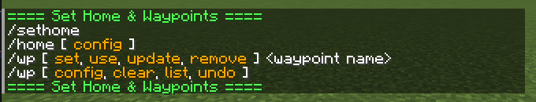
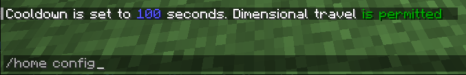
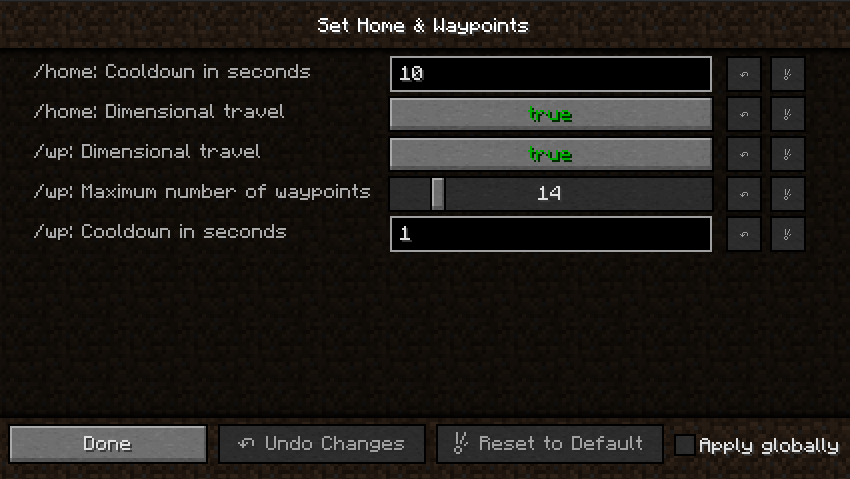
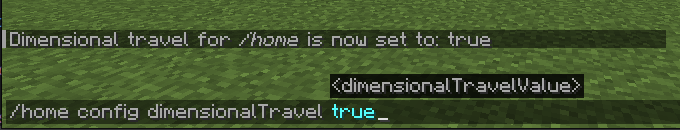
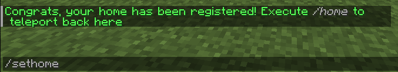
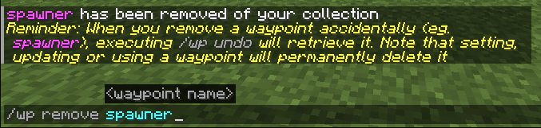

# [Set Home & Waypoints](https://www.curseforge.com/minecraft/mc-mods/set-home-waypoints)

**Set Home & Waypoints** allows players to set a home and waypoints. The development was focused on user experience
(autocomplete, key bind, command feedback, colors…). This mod is configurable on both client and server side.

### 4 commands to master the mod



* `/shw` List all available commands,
* `/sethome` Create or update your home,
* `/home` Teleport to your home,
* `/wp` Set, use, update, remove your waypoints.

### Supported languages

* 🇬🇧 English
* 🇫🇷 French

If your language is missing, you can contribute to this mod on
[GitHub](https://github.com/htachoires/Set-Home-Waypoints) by submitting a pull request.

### Follow project development

You can follow working issues/features on [Trello](https://trello.com/b/BRAy1ouk/set-home-waypoints).

## Installation

First of
all, [Download Set Home & Waypoints on CurseForge](https://www.curseforge.com/minecraft/mc-mods/set-home-waypoints)

Then add downloaded .jar in `mods/` folder on both client and server side.

That's it!

## Configuration

Set Home & Waypoints allows you to configure **cooldown**, **dimensional travel** and **number of waypoints** using
commands (solo + multiplayer) or GUI (only solo) for client and config file for server.

All players can display current home and waypoints configuration by executing `/home config` for home configuration
and `/wp config` for waypoints configuration.



A player with [admin permission](https://minecraft.fandom.com/wiki/Permission_level) can configure the server
in game using `/home config <…>` and `/wp config <…>` commands without restarting the server ✅ Suggestions will guide
players with sufficient permissions.

### Client side using GUI

Note: [Configured mod](https://www.curseforge.com/minecraft/mc-mods/configured) is not available in 1.20.1 yet 



This menu was generated using [Configured mod](https://www.curseforge.com/minecraft/mc-mods/configured). Configured is a
simple and lightweight mod that dynamically creates a configuration menu for every mod.

### Client side using commands

Example of updating **dimensionalTravel** for /home command using command:



### Server side using config file

```toml
#Cooldown in second before home command can be reused
#Range: > 0
shw_home_cooldown = 10
#Cooldown in second before waypoint command can be reused
#Range: > 0
shw_waypoints_cooldown = 1
#Is dimensional travel allowed for home command
shw_is_dimensional_travel_allowed_for_home = true
#Is dimensional travel allowed for waypoints command
shw_is_dimensional_travel_allowed_for_waypoints = true
#Maximum number of waypoints by player
#Range: 0 ~ 100
shw_maximum_number_of_waypoints = 10
```

This configuration file is generated at server initialization in `world/serverconfig/shw-server.toml`.

Setting a new value will take instantly effect. Restarting the server is not necessary.

Updating configuration while the server is running will not notify players.

## Commands usage

All commands have suggestions to guide players in game. `/shw` command will list all available commands.

### `/sethome` and `/home` commands

Home is unique, set your home in any dimension by executing `/sethome`. Then, executing `/home` or pressing `H` key will
teleport you on your home.

Yes, this mod come with a configurable shortcut (`H` key by default) to fast tp to your home. This will certainly save
life.

Note that, re-executing `/sethome` will update home position with player location.



### `/wp` command

Waypoints are used to save additional locations. By default, 10 waypoints are allowed.

Admins can configure this setting using `/wp config maximumWaypointsNumber <count>`.

#### Set, Use, List waypoints

Create waypoints with `/wp set <waypoint name>` and then teleport to them using `/wp use <waypoint name>`.


Executing `/wp list` will show all player waypoints and available space.

#### Update, Remove, Undo waypoints

Waypoints can be updated by executing `/wp update <waypoint name>` or removed by
executing `/wp remove <waypoint name>`.



Last removed waypoint can be rollback by executing `/wp undo`. Note that this action will not be permitted after
setting, updating or using another waypoint.


Waypoints can be cleared by executing `/wp clear`. Be careful, this action will remove all player waypoints and cannot
be rollback.